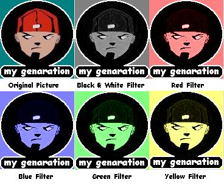

<div align="center">

## Add a color filter to a picture


</div>

### Description

With this few lines of code you can simply add a color filter to a picture (see the ScreenShot!!!). The code is simple and very well comented. Enjoy
 
### More Info
 


<span>             |<span>
---                |---
**Submitted On**   |2001-08-07 10:41:08
**By**             |[Ivan Uzunov](https://github.com/Planet-Source-Code/PSCIndex/blob/master/ByAuthor/ivan-uzunov.md)
**Level**          |Advanced
**User Rating**    |4.0 (12 globes from 3 users)
**Compatibility**  |VB 6\.0
**Category**       |[Graphics](https://github.com/Planet-Source-Code/PSCIndex/blob/master/ByCategory/graphics__1-46.md)
**World**          |[Visual Basic](https://github.com/Planet-Source-Code/PSCIndex/blob/master/ByWorld/visual-basic.md)
**Archive File**   |[Add a colo24210872001\.zip](https://github.com/Planet-Source-Code/ivan-uzunov-add-a-color-filter-to-a-picture__1-25926/archive/master.zip)

### API Declarations

```
Private Declare Function GetPixel Lib "gdi32" (ByVal hdc As Long, ByVal X As Long, ByVal Y As Long) As Long
Private Declare Function SetPixel Lib "gdi32" (ByVal hdc As Long, ByVal X As Long, ByVal Y As Long, ByVal crColor As Long) As Long
```


